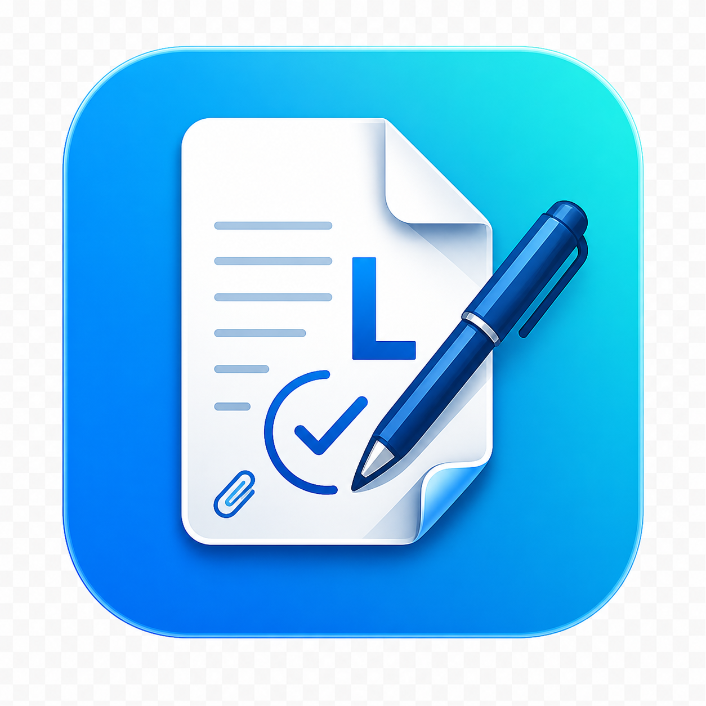

# Lembar

<p align="center">
  
</p>

Python command-line tools for inspecting, extracting, editing, and validating PDF files.

## Setup

This project uses Python 3.14 through pyenv.

```zsh
pyenv local lembar
python -m pip install -e .
```

You can also install dependencies from the requested requirements file:

```zsh
python -m pip install -r requirement.txt
```

OCR requires native tools: Tesseract and Ghostscript.

macOS:

```zsh
brew install tesseract ghostscript
```

Debian/Ubuntu:

```zsh
sudo apt update
sudo apt install tesseract-ocr ghostscript
```

Fedora:

```zsh
sudo dnf install tesseract ghostscript
```

Arch Linux:

```zsh
sudo pacman -S tesseract ghostscript
```

Windows with winget:

```powershell
winget install UB-Mannheim.TesseractOCR
winget install ArtifexSoftware.GhostScript
```

Windows with Chocolatey:

```powershell
choco install tesseract ghostscript
```

After installing native tools on Windows, make sure `tesseract.exe` and `gswin64c.exe` are available on `PATH`.

## Usage

All commands are available under one CLI:

```zsh
lembar --help
```

### Inspection

```zsh
lembar info file.pdf
lembar info --json file.pdf
lembar pages-info file.pdf
lembar pages-info --json file.pdf
```

### Page Operations

```zsh
lembar merge output.pdf input1.pdf input2.pdf
lembar merge output.pdf signed1.pdf signed2.pdf --preserve-as-attachments
lembar split input.pdf output-dir
lembar extract-pages input.pdf output.pdf --pages 1,3-5
lembar delete-pages input.pdf output.pdf --pages 2
lembar reorder-pages input.pdf output.pdf --pages 3,1,2
lembar rotate-pages input.pdf output.pdf --pages all --degrees 90
lembar crop-pages input.pdf output.pdf --box 0 0 300 400
lembar resize-pages input.pdf output.pdf --width 612 --height 792
lembar compress input.pdf output.pdf
```

Page ranges are 1-based and support `all`, `*`, `1`, `1-3`, and `1,3,5-7`.

`merge` warns when digitally signed PDFs are merged because page merging rewrites PDF bytes and invalidates original cryptographic signatures on the merged pages. Use `--preserve-as-attachments` to embed the original signed PDFs unchanged as attachments.

### Extraction

```zsh
lembar extract-text input.pdf --pages all
lembar extract-text input.pdf --pages 1-2 --output text.txt
lembar extract-images input.pdf output-dir --pages all
lembar extract-tables input.pdf output-dir --pages all
lembar ocr scanned.pdf searchable.pdf --language eng
```

`extract-tables` writes one CSV file per detected table. Wrapped prose inside cells is normalized, while numbered-list line breaks are preserved.

### Editing

```zsh
lembar add-text input.pdf output.pdf --text "Approved" --x 300 --y 100
lembar add-image input.pdf output.pdf --image stamp.png --x 50 --y 50 --width 120 --height 60
lembar watermark input.pdf output.pdf --text DRAFT
lembar page-numbers input.pdf output.pdf
lembar redact-region input.pdf output.pdf --x 10 --y 10 --width 100 --height 50
```

Note: `redact-region` currently adds a visual cover. It is not yet safe for sensitive redaction because underlying content may remain in the PDF.

### Forms and Security

```zsh
lembar list-fields form.pdf --json
lembar fill-form form.pdf output.pdf --data values.json
lembar fill-form form.pdf output.pdf --data values.json --flatten
lembar flatten-form form.pdf output.pdf
lembar encrypt input.pdf encrypted.pdf --password secret
lembar decrypt encrypted.pdf output.pdf --password secret
```

### Signatures

```zsh
lembar signature-check signed.pdf
lembar signature-check --json signed.pdf
lembar signature-check --names-times signed.pdf
lembar signature-validate signed.pdf
lembar signature-validate --json signed.pdf
```

`signature-check` extracts PDF signature dictionaries and CMS/CAdES certificate details. `signature-validate` is currently a best-effort summary and does not yet perform full trust-store, revocation, or timestamp-authority validation like Adobe Acrobat.

## Development

Run tests:

```zsh
PYTHONPATH=src python -m unittest discover -s tests
python -m compileall src tests
```

## License

[](LICENSE)

Lembar is released under the BSD 3-Clause License. See [LICENSE](LICENSE).
